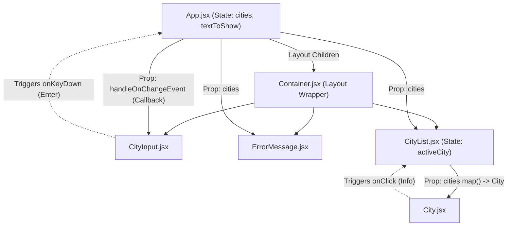

# Learning React Concepts

A hands-on, educational repository designed to demonstrate and master the core foundations of modern React development. The repository currently features **PropsAndStates**, a fully functional, interactive Cities Dashboard showcasing best practices in state management, modular styling, and component reusability using **React 19**, **Vite**, **CSS Modules**, and **Bootstrap 5**.

---

## 🛠️ Technology Stack & Dependencies


---

## 🚀 Key React Architecture Concepts Taught

*   **📦 Props & Children Composition**: Demonstrates passing read-only properties down the component hierarchy, including layout wrappers (`Container.jsx`) utilizing the `children` prop.
*   **💾 State Management (`useState`)**: Illustrates how to track reactive local state variables, such as list collections (`cities`) and specific active elements (`activeCity`).
*   **⬆️ Lifting State Up**: Practices passing callback triggers (`handleOnChangeEvent`) from parent elements to child input inputs, allowing state mutation at the parent scope level.
*   **🎨 Scoped CSS Modules**: Prevents style leaks across components by using CSS Modules (`City.module.css`, `CityInput.module.css`, `Container.module.css`).
*   **🧩 Conditional Rendering**: Renders empty-state fallback screens (e.g., `No city Added` alert) using standard JSX logical `&&` evaluators.
*   **🔄 Pure Lists Mapping**: Renders lists of dynamic elements efficiently using unique identifier keys (`key={city}`).

---

## 📐 Component & Data Flow Hierarchy

The following diagram maps out how data is passed down through Props and how events are bubbled up using callbacks:



---

## 📂 Repository File Directory

```
Learning-React-Concepts/
└── PropsAndStates/                # Core sub-project demonstrating Props & States
    ├── src/
    │   ├── components/            # Reusable functional components
    │   │   ├── City.jsx           # Individual city card displaying Info button
    │   │   ├── City.module.css    # Scoped styles for the City card
    │   │   ├── CityInput.jsx      # Managed text input box
    │   │   ├── CityInput.module.css # Scoped input layout styles
    │   │   ├── CityList.jsx       # Component managing active state tracking
    │   │   ├── Container.jsx      # Content layout structural wrapper
    │   │   ├── Container.module.css # Scoped alignment/border properties
    │   │   └── ErrorMessage.jsx   # Empty listing fallback warning UI
    │   ├── App.jsx                # Main Application entry managing global cities state
    │   ├── App.css                # Global style overrides
    │   └── main.jsx               # Bootstrapping script mounting App to index.html
    ├── index.html                 # HTML template referencing React entry point
    ├── vite.config.js             # Vite compilation and HMR server settings
    ├── eslint.config.js           # Lint rules for code quality enforcement
    └── package.json               # Manifest file declaring project dependencies
```

---

## 📝 Key Source Code Showcases

### 1. Lifting State Up & State Mutation ([App.jsx](file:///d:/for%20CV/My%20learnings/Learning-React-Concepts/PropsAndStates/src/App.jsx))
Defines the `cities` state array, and passes down a state modifier callback that updates the list when the enter key is pressed:
```jsx
function App() {
  let [cities, setCities] = useState([]);

  let handleEvent = (event) => {
    if (event.key === "Enter") {
      let newCity = event.target.value;
      event.target.value = "";
      let cityList = [...cities, newCity]; // Immutable state update
      setCities(cityList);
    }
  };

  return (
    <Container>
      <h1>Cities</h1>
      <CityInput handleOnChangeEvent={handleEvent} />
      <ErrorMessage cities={cities} />
      <CityList cities={cities} />
    </Container>
  );
}
```

### 2. Passing Action Callbacks down the Tree ([CityList.jsx](file:///d:/for%20CV/My%20learnings/Learning-React-Concepts/PropsAndStates/src/components/CityList.jsx))
Injects active states and event listeners into standard sub-items through mapping:
```jsx
const CityList = ({ cities }) => {
  let [activeCity, setActiveCity] = useState([]);

  let handleEvent = (event, city) => {
    let selectedCities = [...activeCity, city];
    setActiveCity(selectedCities);
  };

  return (
    <ul className="list-group text-start">
      {cities.map((city) => (
        <City
          key={city}
          city={city}
          active={activeCity.includes(city)}
          handelClickEvent={(event) => handleEvent(event, city)}
        />
      ))}
    </ul>
  );
};
```

### 3. Styled Component with CSS Modules ([City.jsx](file:///d:/for%20CV/My%20learnings/Learning-React-Concepts/PropsAndStates/src/components/City.jsx))
Utilizes CSS module classes to guarantee zero selector collision with surrounding components:
```jsx
import styles from "./City.module.css";

const City = ({ city, active, handelClickEvent }) => {
  return (
    <li className={`list-group-item ${active && "active"}`}>
      {city}
      <button
        value={city}
        onClick={handelClickEvent}
        className={`${styles.button} btn btn-info`}
      >
        Info
      </button>
    </li>
  );
};
```

---

## 🚀 Setup & Execution Guide

### Prerequisites
Make sure the following are installed:
*   **Node.js** version 18.0 or higher
*   **npm** (Node package manager)

### Installation & Run Steps
1.  **Clone the Repository**:
    ```bash
    git clone https://github.com/Imtiaz-Ali17314/Learning-React-Concepts.git
    cd Learning-React-Concepts
    ```
2.  **Install Node Dependencies**:
    ```bash
    npm install
    ```
3.  **Start Vite Local Development Server**:
    ```bash
    npm run dev
    ```
    This fires up the dynamic HMR (Hot Module Replacement) development server. Access the application in your browser at:
    *   `http://localhost:5173`

4.  **Run Code Linter**:
    To analyze code styling guidelines and syntax warnings:
    ```bash
    npm run lint
    ```
5.  **Build Production Assets**:
    To transpile, optimize, and minify components for live deployment builds:
    ```bash
    npm run build
    ```
